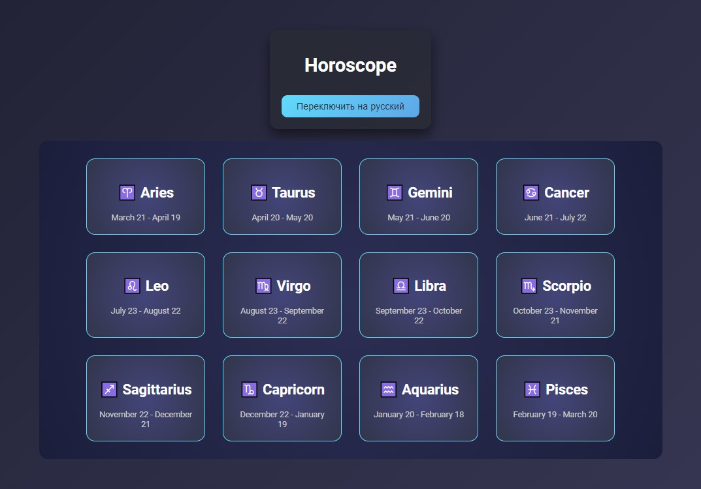

# 🔮 Telegram Horoscope App

**Telegram Horoscope App** is a web application integrated with Telegram Bot API to provide daily horoscopes based on user zodiac signs. The app supports both English and Russian languages, making it accessible to a wider audience.

---

## 🛠️ Technologies
- **Frontend:**
  - React (for dynamic UI)
  - CSS Modules (for component styling)
- **Backend:**
  - Node.js
  - Telegram Bot API
  - Hosted on Vercel
- **APIs:**
  - Horoscope API for fetching zodiac descriptions

---

## 🌟 Features
- 🌐 **Multilingual Support**: Switch between English and Russian easily.
- ✨ **Dynamic Zodiac Selection**: Choose your zodiac sign and get real-time horoscope updates.
- 🕵️ **Telegram Integration**: Access the app via Telegram commands (`/start`, `/stop`).
- 💾 **Persistent State**: Save and reload user preferences dynamically.

---

## 🚀 How to Use
1. Launch the app by clicking the provided Telegram link.
2. Use `/start` in the Telegram chat to get a welcome message and open the horoscope app.
3. Select your zodiac sign in the app to see your daily horoscope.
4. Use `/stop` to terminate the bot interaction.

---

## 📥 Installation

1. Clone the repository and navigate to the project directory:
   git clone https://github.com/yourusername/telegram-horoscope-app.git

2. Install dependencies:
   npm install

3. Set up a `.env` file with your Telegram bot token:
   TELEGRAM_BOT_TOKEN=your_bot_token_here

4. Start the development server:
   npm start

5. Deploy the app on Vercel or your preferred hosting platform.

---
